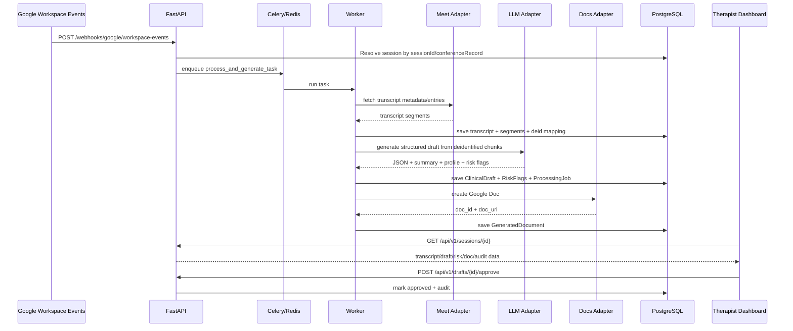

# Architecture

`therapy-meet-copilot` is a clinical documentation copilot for therapists.

## Product Safety Position
- The system is assistive, not autonomous.
- Generated outputs are drafts and hypotheses for review.
- Human review is mandatory before approval.
- Final diagnosis and medication recommendations are explicitly out of scope.

## Monorepo Structure
- `apps/api`: FastAPI app, domain/application/infrastructure layers, Alembic, tests.
- `apps/web`: Next.js dashboard (Spanish UI).
- `workers`: Celery worker package entrypoints.
- `packages/shared`: shared schema assets.
- `docs`: architecture and operational docs.
- `infra`: Dockerfiles.
- `scripts`: local helper scripts.

## Backend Layering
- `domain`: entities, enums, schema contracts.
- `application/services`: orchestration and business workflows.
- `infrastructure/adapters`: Google/OpenAI integrations, de-identification, normalization.
- `api/routes`: REST endpoints.
- `worker/tasks`: asynchronous pipeline jobs via Celery.

## Processing Pipeline
1. Receive Google Workspace event webhook.
2. Resolve session and enqueue processing task.
3. Fetch transcript entries (Google adapter or fixture adapter).
4. Normalize + merge segments + stable speaker labeling.
5. De-identify transcript and persist reversible mapping in DB only.
6. Chunk transcript and call OpenAI Responses API via adapter.
7. Validate structured output with Pydantic.
8. Persist clinical draft version and risk flags.
9. Create Google Doc (or mock local artifact) and optional DOCX export.
10. Expose everything in therapist dashboard + audit logs.

## Sequence Diagram

## Security Controls (MVP)
- Password hashing (`bcrypt` via Passlib).
- JWT access + refresh model.
- CSRF double-submit check on refresh flow.
- Sensitive field encryption wrapper (`EncryptedString`) when `ENCRYPTION_KEY` is set.
- Secret redaction in structured logs.
- Prompt version and model stored per draft.
- No de-identification mapping emitted to logs or prompts.

## Real vs Mock Integrations
- `USE_MOCK_GOOGLE=true`: fixture transcript + local mock doc artifacts.
- `USE_MOCK_OPENAI=true`: deterministic mock clinical generation.
- Toggle to real integrations by providing Google and OpenAI credentials in env vars.